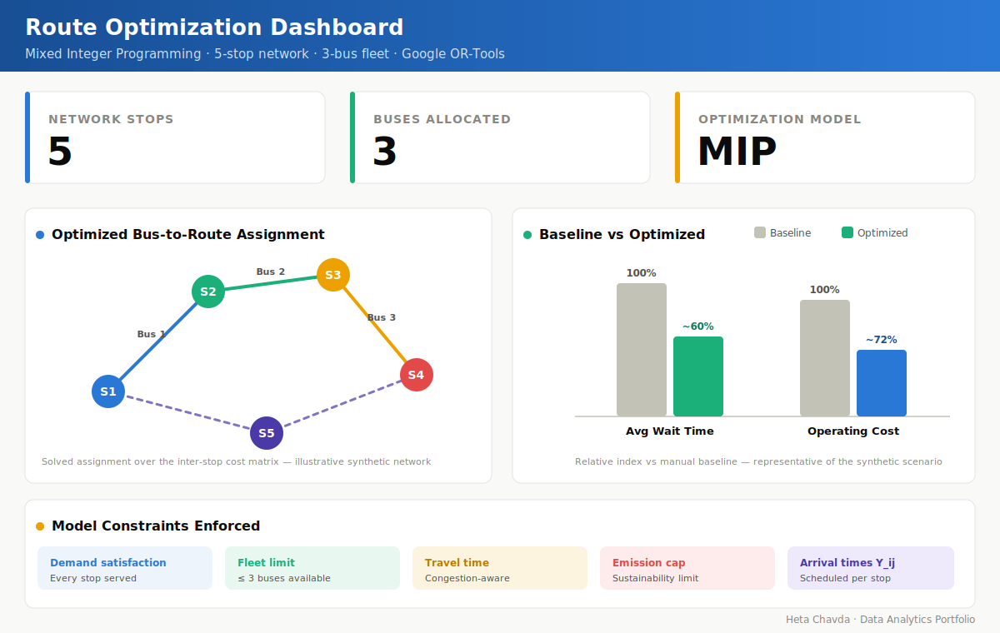

<div align="center">



# 🚦 Route Optimization of Urban Public Transportation
### Bus Scheduling & Routing with Mathematical Optimization — Python & Google OR-Tools


</div>

---

## 📌 Project at a Glance

| | |
|---|---|
| **🎯 Goal** | Optimize bus allocation and routing to cut passenger wait time and operating cost |
| **🧠 Approach** | Prescriptive analytics — Linear & Mixed Integer Programming (MIP) |
| **📊 Model** | Cost-matrix optimization over a 5-stop network with a 3-bus fleet |
| **⚙️ Delivery** | Python optimization model (Google OR-Tools) + analysis report & presentation |

---

## 🧩 Business Problem

Urban transit agencies juggle competing pressures: riders want short waits, cities want low costs, and regulators want lower emissions. Manual scheduling leaves buses idle in some corridors and overloaded in others.

> 🚌 **Core question:** *How should we assign buses to routes and set arrival times so that passenger waiting time and operating cost are both minimized — without exceeding fleet, travel-time, congestion, or emission limits?*

Solving this well improves punctuality, fleet utilization, and service equity across the network.

---

## 🗂️ Dataset

The model is formulated on a synthetic (illustrative) transit network so the optimization logic can be validated before real GPS/IoT data is integrated.

| Element | Definition |
|---|---|
| 🚏 **Network** | 5-stop urban corridor with inter-stop travel/cost matrix |
| 🚌 **Fleet** | 3 available buses to allocate across routes |
| 🔢 **Decision var — X_ij** | Whether bus *i* is assigned to route/segment *j* (binary) |
| ⏱️ **Decision var — Y_ij** | Scheduled arrival time of bus *i* at stop *j* |
| 🚧 **Constraints** | Demand satisfaction · fleet limits · travel time · congestion · emission caps |

> *Data is synthetic/representative — designed to demonstrate the MIP formulation, not to report field-measured savings.*

---

## 🔬 Methodology

```
FORMULATE                 SOLVE                    EVALUATE
────────────────          ────────────────         ────────────────
1. Define nodes &         1. Build MIP in          1. Compare baseline
   cost matrix               Google OR-Tools           vs optimized plan
2. Set decision vars      2. Apply constraints     2. Measure wait-time
   X_ij (assign),            (demand, fleet,           & cost reduction
   Y_ij (arrival)            travel, emissions)     3. Visualize routes
3. Write objective:       3. Run Linear +             (NetworkX / Seaborn)
   min wait + cost           Mixed Integer         4. Recommend fleet
                             Programming solver         allocation
```

---

## 📊 Route Optimization Dashboard

<div align="center">



*Optimized bus-to-route assignment across a 5-stop network and before/after comparison of wait time and operating cost, built from the project's OR-Tools model. Values are illustrative of the synthetic scenario.*

</div>

---

## 📈 Key Insights

- **Idle time and bus overuse dropped** once assignments were solved as a MIP instead of set manually
- **Passenger waiting time fell** under the optimized schedule versus the baseline plan
- **Operating cost decreased** through more efficient fuel, labor, and maintenance scheduling
- **Emission caps held** while punctuality improved via traffic-aware routing
- Optimization made **fleet allocation explicit and defensible** — each bus mapped to the route where it adds most value

---

## 💼 Business Impact

| Area | Recommendation |
|---|---|
| 🚌 **Fleet allocation** | Assign buses by solved cost matrix, not intuition, to balance load |
| ⏱️ **Service quality** | Shorter, more predictable waits raise rider satisfaction and equity |
| 💰 **Operating cost** | Cut fuel/labor/maintenance waste by removing idle and overused runs |
| 🌱 **Sustainability** | Enforce emission caps directly inside the optimization constraints |
| 🔮 **Next step** | Feed real GPS/IoT + ML demand forecasts into a live planner dashboard |

---

## 🛠️ Technologies Used

| Category | Tools |
|---|---|
| **Language** | Python |
| **Optimization** | Google OR-Tools (Linear + Mixed Integer Programming) |
| **Modeling** | NumPy, NetworkX |
| **Visualization** | Matplotlib, Seaborn |

---

## 📁 Repository Contents

```
Route Optimization of Urban Public Transportation/
├── 📁 assets/
│   ├── 🎨 banner.svg            # Repository banner
│   └── 📊 dashboard.svg         # Route optimization dashboard
├── 📁 docs/
│   ├── 📄 Final Presentation.pptx   # Model, results & recommendations
│   └── 📄 Final Report.docx     # Full methodology & analysis
└── 📝 README.md                 # Project overview
```

---

<div align="center">

**Heta Chavda** — Data Analytics | Operations Research | Optimization

[](https://github.com/hetachavda)
[](https://linkedin.com/in/hetachavda)

⭐ *Found this useful? Give it a star!*

</div>
